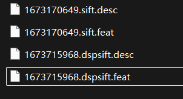
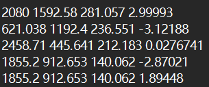

## feat 文件格式
文件名包含了采用什么方法生成的，比如sift, dspsift等方法
<div style="display: flex; gap: 10px;">
  
  
</div>

.feat文件每行包含四个数字，分别表示特征点的x, y, scale, orientation。其中原点 (0,0) 位于图像左上角，x 轴向右，y 轴向下，scale 表示特征点的尺度，orientation 表示特征点的方向。
- scale 值越大，代表这个特征对应的图像结构越大或越模糊
- orientation 值越大，代表这个特征对应的图像结构越垂直或越水平。通常以弧度 (radians) 为单位，表示该特征点周围图像梯度的主要方向，可用于实现旋转不变性。

## desc文件
.desc 文件则描述了特征点周围图像的独有特征，比如sift特征点的描述符。是一个128 维的向量，是“数字指纹”，每个数字表示特征点周围图像的某个特征，是进行图像关键点匹配的核心。

## 匹配
<h4>度量方式</h4>
描述符向量间的距离越小，代表这两个特征点的描述符越相似，从而认为这两个特征点是同一个对象。
- 欧式距离：如SIFT。
- 汉明距离：如ORB。
<h4>匹配策略</h4>
确定度量标准后，匹配策略有两种
- 暴力匹配器 (Brute-Force Matcher)：原理简单直接，就是将A中的每个描述符，与B中的所有描述符进行距离计算，并从中选出最近的。BFMatcher
- FLANN 匹配器 (Fast Library for Approximate Nearest Neighbors Matching)：这是一种近似最近邻搜索库，能为大规模特征集快速建立索引，以极小的精度牺牲换取极大的速度提升，常用于实时或大型场景。广泛用于图像检索、目标识别、全景拼接、SLAM 等场景。Opencv中为FlannBasedMatcher
- FLANN的思想：不保证找到绝对最近邻，而是快速找到近似最近邻（Approximate Nearest Neighbor）。内部数据结构:
    KD-Tree
    Hierarchical K-Means Tree
    Composite Tree
    Autotuned Index

```python
import cv2

img1 = cv2.imread("box.png", 0)
img2 = cv2.imread("box_in_scene.png", 0)

sift = cv2.SIFT_create()

kp1, des1 = sift.detectAndCompute(img1, None)
kp2, des2 = sift.detectAndCompute(img2, None)

index_params = dict(algorithm=1, trees=5)
search_params = dict(checks=50)
flann = cv2.FlannBasedMatcher(index_params, search_params)
matches = flann.knnMatch(des1, des2, k=2)
good = []
for m, n in matches:
    if m.distance < 0.75 * n.distance:
        good.append(m)
result = cv2.drawMatches(img1, kp1, img2, kp2, good, None)
cv2.imshow("match", result)
cv2.waitKey(0)
```

## image_matching
与feature_matching 不同，是将同场景图片进行匹配，从而避免大量的图片计算。比如图片1和图片100不在同一场景，即角度很大没有公共点，这两张图片就不需要进行match.
### 图片快速匹配的方法
采用的是Visual Vocabulary（视觉词袋），类似图像搜索的方法。


## 使用UV管理
### 以前
pip install requests
python -m venv .venv
pip install -r requirements.txt
pip freeze > requirements.txt

### 现在
uv pip install requests
uv venv
uv pip sync requirements.txt
uv pip freeze > requirements.txt

